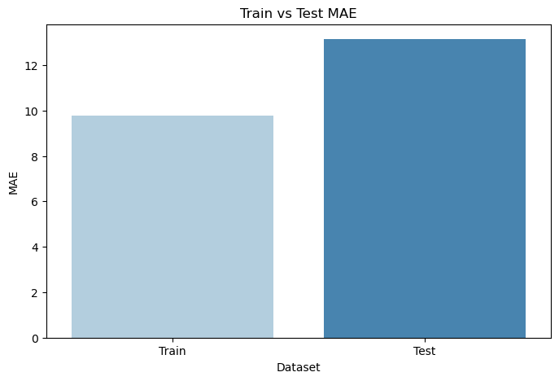
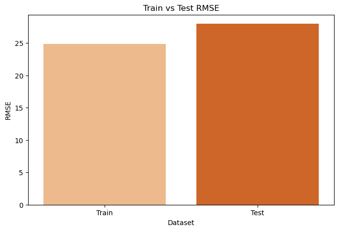
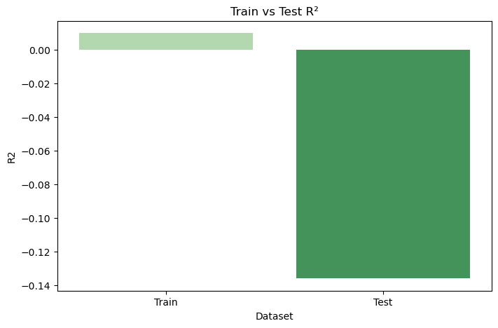
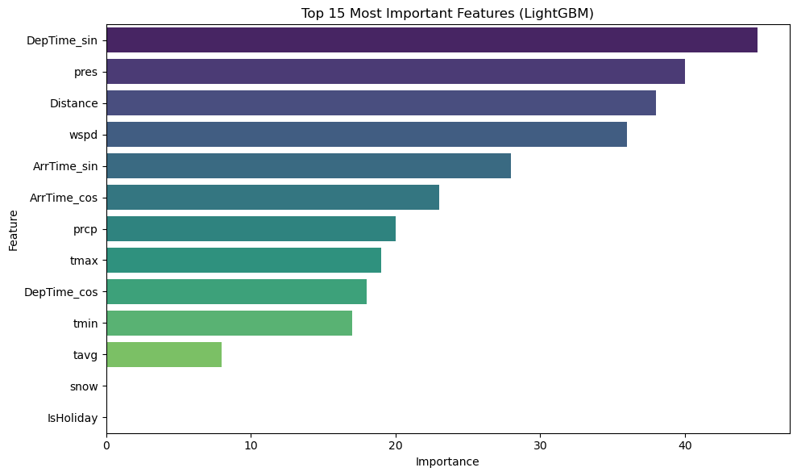
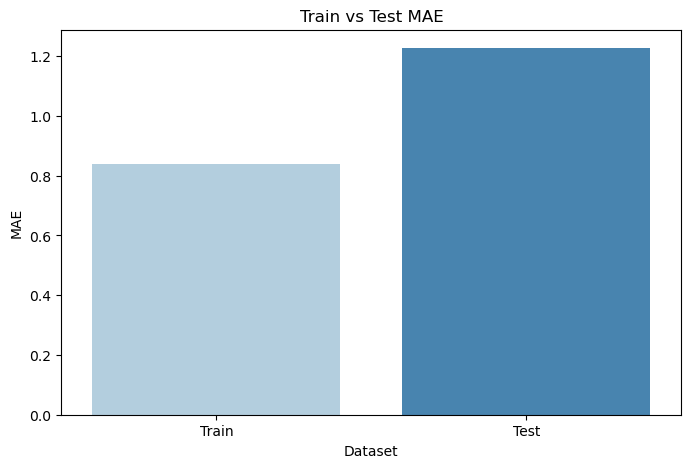
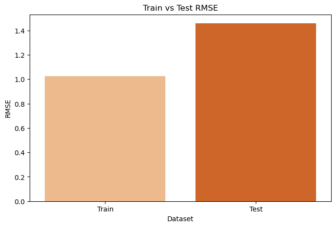
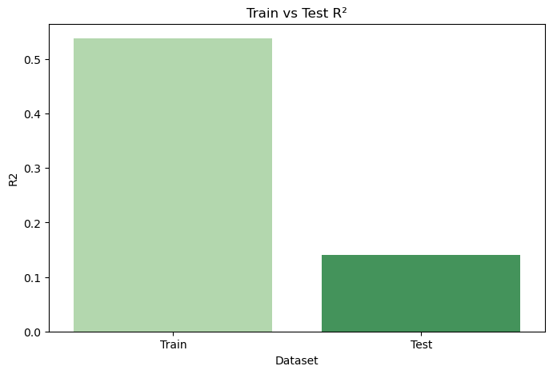
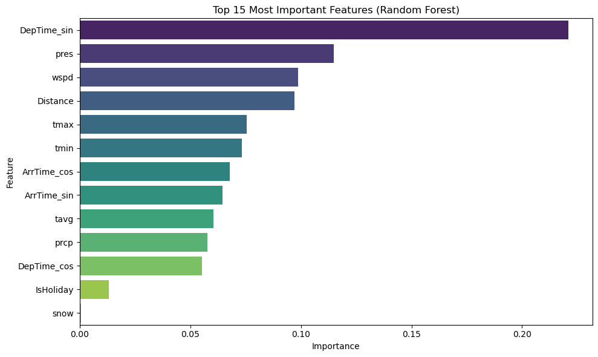

# LightGBM Results
## Plots
### MAE

### RMSE

### R^2

### Feature Importances

## Interpretations
The LightGBM model exhibited worse performance overall on the test set compared to the train set, and produced a negative R^2 value on the test set, indicating that the model performed worse than a naive mean forecast.

Interestingly, pressure dominated over other weather factors such as wind speed, precipitation, and snow in the model. Departure time and distance had a greater impact on the model overall than weather factors, suggesting that weather conditions have less effect on flight delays than logistical factors.
# Random Forest Results
## Plots
### MAE

### RMSE

### R^2

### Feature Importances

## Interpretations
Similar to the LightGBM model, the Random Forest model performed worse overall on the test set compared to the train set, but outperformed the LightGBM model in each category. The Random Forest model reached a maximum R^2 of about .15, reflecting the overall poor performance of ensemble learning models. Weather factors had greater importance on the Random Forest model, but logistical variable such as departure time and distance still ranked towards the top.